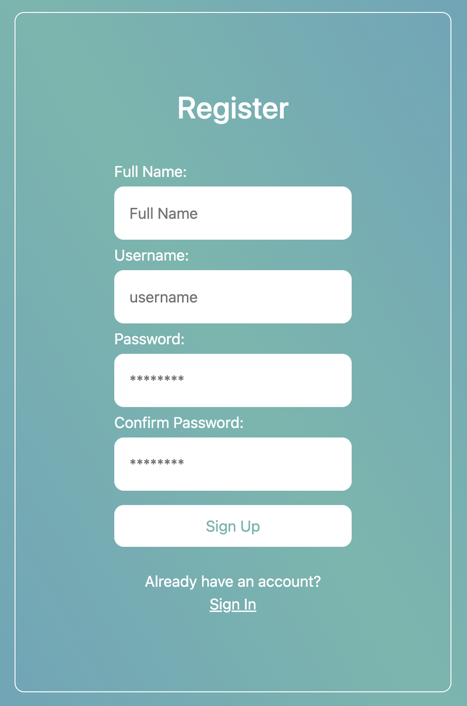

# Event reminder

Do not forget important events! 
Write it down once and **NEVER** forget it.

## About

The application is divided into frontend and backend part. In order for the application to work, three servers are started:

- the server on the frontend
- the server on the backend
- the server for the mysql database

## Frontend

The frontend is made with the **React js**.  
All code related to the frontend is located in the [front](/front/) folder.

## Backend

The backend is made with the programming language **Go**. 
All code related to the backend is located in the [server](/server/) folder. 
Communication with the database is done through the backend.

## Login and Register

The first page that is launched when starting the application is the Login page. If the user already has an account, he needs to enter his credentials. There is a verification system that checks whether the credentials are entered correctly, or whether such an account already exists in the system. After successful login, the user is sent to the Home screen.

  
  

If the user does not have an account, he needs to select the Sign Up option at the bottom of the screen, which will take him to the registration screen. During registration, it is necessary to fill in each field so that it meets the requirements defined for it, otherwise the registration will not be successful. Also, it is necessary that the user with that username does not exist in the database in order to be entered into the system.

  
  

If the registration is successful, a specific message with the Sign in option is displayed on the screen to transfer the user to the Login page.

  

## Home

Since the user has successfully logged in, the Home screen is in front of him. It is made up of 3 parts: 
- The first part represents a **timer** that ticks and shows how much time is left until the first next event that occurs.
- The second part presents a **list of events** created by the user. The events are sorted by time so that the most recent events are displayed first.
- The third part presents a **calendar** with which the user can find his way more easily in order to know when he wants to make an event.
  

  

When the timer ticks, a notification will be displayed that it is time for the event and the timer will start counting down the time for the first next event:

  

